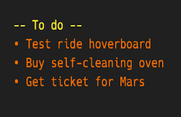

# Google Tasks widget for Übersicht
## (Übersicht Google Widgets Bundle)

A new year and a new widget. Let's make 2017 a good year!

This widget shows latest X number of Google tasks, using Oauth.



## Setup:
1. Perhaps obvious but you would need a google account
2. Go to https://console.developers.google.com > click on API Project > select Create project > fill in your project name > click on create
3. Make sure you are in API Manager and click on Enable API and select Tasks API to enable
4. Go to OAuth consent screen > fill in/choose your gmail address > fill in Product name shown to users with the same name that you chose in the step 2 above > make sure to save
5. Select Credentials > select Create credentials > select OAuth client ID > select Other > fill in the name such as ubersicht > copy client ID and client secret > paste them in the tasks.coffee file after CLIENT_ID: and CLIENT_SECRET: under the Google API Credentials section. Note that you would need to store them as string i.e. surround them with ```""```.
Your tasks.coffee file's Google API Credentials section should look like the following:

    ```
    CLIENT_ID: "your_client_id"
    CLIENT_SECRET: "your_client_secret"
    AUTHORIZATION_CODE:""
    ```
    
6. Saving your script should launch a web browser asking whether you would like to allow your app to view gmail. Click Allow and the next screen will show a code. Please copy and paste it in the cred file besides AUTHORIZATION_CODE:. In case a browser does not launch please click on Refresh All Widgets option found in Ubersichts icon on your mac menu bar. At this point your tasks.coffee file's Google API Credentials section should have the following:

    ```
    CLIENT_ID: "your_client_id"
    CLIENT_SECRET: "your_client_secret"
    AUTHORIZATION_CODE: "your_authorizaion_code"
    ```
    
7. Specify the number of tasks you would like to display. For example:

    ```
    TASK_COUNT:"10"
    ```

8. Save the tasks.coffee file and your tasks should show now if all goes well. Try refreshing all widgets if your tasks do not show.

## Notes:
- Make sure to name the project name (where you get your client ID and client secret) the same as the oauth product name. Else it seems to return an error when obtaining authorization code.
- You may add calendars as you like. Please make sure the calendar names do not contain white spaces due to the current limitation. You can for instance use underscore to bind words in the calendar names.

## Lastly...
The sample events on the screenshot are not supposed to make sense. They were written for testing purposes.
Translation was done using the tool :http://translatr.varunmalhotra.xyz/

This is part of the Google Widgets Bundle for Übersicht. 
Check out other widgets:

https://github.com/louixs/ubersicht_google_calendar
https://github.com/louixs/ubersicht_gmail

My other widgets:
https://github.com/louixs/tsushin

## Credits:
parsej.sh is made by the devs at ShellShoccar-jpn. Huge thanks to ShellShoccar-jpn.
https://github.com/ShellShoccar-jpn/Parsrs/blob/master/parsrj.sh

## Disclaimer:
This widget especially the oauth.sh is still at beta stage. Please use at your own risk. I would also highly appreciate constructive feedback. Many thanks.

## To-do:
 

## Changelog:

